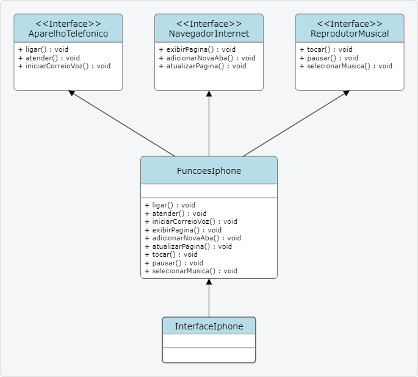

# DESAFIO DE PROJETO - POO

Este projeto foi elaborado com intuíto executar o desafio de projeto proposto pelo  professor [Gleyson Sampaio](https://github.com/glysns), onde foi possível aplicar os conhecimentos de Java adiquiridos até o momento no  bootcamp **Santander 2024 - Backend com Java**, em parceria com a [DIO](https://web.dio.me/).

## Modelagem e Diagramação de um Componente iPhone

1. A primeira etapa deste projeto foi a diagramação e modelagem UML do componente iPhone;
2. Na segunda etapa foram implementadas, em JAVA, as classes representadas no diagrama UML.

## DIAGRAMA UML

